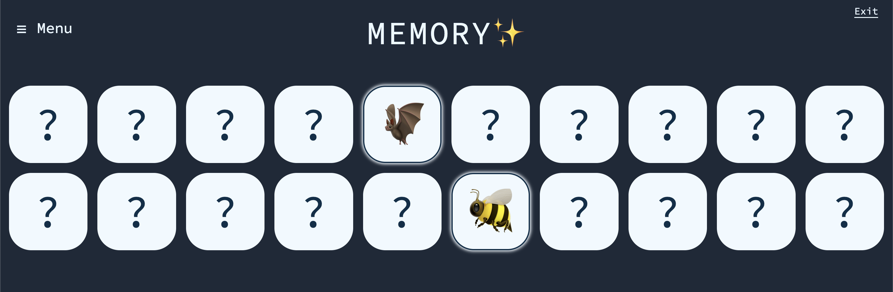

# 🧠 Memory Game

A simple and fun memory matching game built using **React**. Test your memory by flipping cards and matching pairs!

## 🚀 Demo

[Live Demo](https://memory-game-react-dusky.vercel.app/)

## 📸 Screenshot



## 🛠️ Features

- Flip cards to reveal images
- Match pairs to score
- Responsive design

## 🧰 Tech Stack

- **React**
- **Tailwind CSS** for styling

## 📦 Installation

1. **Clone the repository**
   ```bash
   git clone https://github.com/defydef/memory-game-react.git
   cd memory-game-react
   ```
